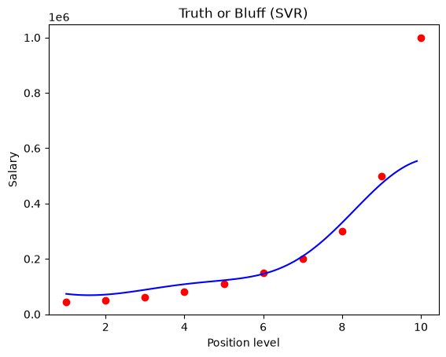

# Support Vector Regression in Python

Support vector regression (SVR) predicts a numerical response while balancing model complexity against prediction errors. Its epsilon-insensitive loss ignores residuals within a chosen tolerance and penalizes the excess beyond it. The [notebook](support_vector_regression.ipynb) applies an RBF kernel model to the included [position salary dataset](Position_Salaries.csv).

## Linear model and loss function

Start with a linear prediction function:

```math
\Large f(x) = x^{\mathsf T}\beta + \beta_0.
```

- $x$: the input vector, containing the predictor values for one observation.
- $f$: the prediction function, which maps an input to a numerical response.
- $\beta$: the vector of coefficients, or weights, applied to the predictors.
- $\beta_0$: the intercept, the predicted response when all input values are zero.
- $\mathsf T$: the transpose symbol; the product here sums each predictor value multiplied by its corresponding coefficient.

With one predictor, this function is a straight line. SVR can also fit curved relationships by using a kernel, described below. The intercept may have limited practical meaning when the all-zero input lies outside the observed data.

The discrepancy between an observation and its prediction is

```math
\Large r_i = y_i - f(x_i).
```

Here, $y$ is the observed response and $r$ is the residual. The index $i$ identifies an observation throughout the equations. Positive residuals mean the model underpredicts; negative residuals mean it overpredicts. These differences are measured along the response axis.

The epsilon-insensitive loss is

```math
\Large V_\epsilon(r) =
\begin{cases}
0 & \text{if } |r| \leq \epsilon, \\
|r| - \epsilon & \text{if } |r| > \epsilon.
\end{cases}
```

- $V_\epsilon$: the loss assigned to a residual under the chosen tolerance.
- $\epsilon$: a nonnegative tolerance in response units.
- $|r|$: the magnitude of the residual, regardless of its sign.

Imagine a tube extending epsilon units above and below the prediction curve. Points inside the tube or exactly on its boundary have zero loss. Outside the tube, only the excess distance beyond the boundary counts. For example, with epsilon equal to 2, a residual of 1 has zero loss, while a residual of 5 has loss 3.

The tube has total vertical width twice the tolerance. It is a fitting tolerance, not a confidence interval or a guarantee that future observations will fall inside it. Outside the tube, the loss increases linearly rather than quadratically, so large residuals receive less rapidly increasing penalties than under squared-error loss.

To balance fit against model complexity, minimize

```math
\Large H(\beta,\beta_0)
= \sum_{i=1}^{N}V_\epsilon\!\left(y_i-f(x_i)\right)
+ \frac{\lambda}{2}\|\beta\|^2.
```

- $H$: the training objective minimized when fitting the model.
- $N$: the number of training observations.
- $\sum$: adds the terms over the indicated index range.
- $\lambda$: a positive regularization parameter controlling the penalty on the coefficients.
- $\|\beta\|^2$: the squared Euclidean norm, equal to the sum of the squared coefficients.

The first term adds the losses outside the tube; the second discourages large coefficients. The intercept is not penalized. For a single linear predictor, shrinking the coefficient makes the line flatter. Increasing regularization gives more weight to this preference, even if it leaves larger residuals outside the tube.

Epsilon and regularization control different aspects of the fit. Epsilon determines which discrepancies are free; regularization determines how much the model prioritizes smaller weights over reducing the remaining discrepancies. Both should be selected using validation data or cross-validation rather than judged only by training fit.

## Solution and support vectors

The fitted linear coefficient vector can be expressed as a weighted sum of training inputs:

```math
\Large \hat\beta = \sum_{i=1}^{N}a_i x_i.
```

A hat marks a fitted quantity. Each $a_i$ is a signed weight learned through the constrained optimization underlying SVR. This notation collects the difference of the two nonnegative dual weights associated with an observation, with their scaling absorbed into the signed weight.

Substituting this expression into the linear model gives

```math
\Large \hat f(x)
= \sum_{i=1}^{N}a_i\langle x_i,x\rangle + \hat\beta_0.
```

The brackets $\langle x_i,x\rangle$ denote an inner product, the sum of products of corresponding input coordinates. Instead of describing predictions directly through one coefficient per predictor, this expression describes them through weighted comparisons with training inputs.

Observations with nonzero signed weights are the **support vectors**. With positive epsilon, points strictly inside the fitted tube have zero weights in the exact optimum. Support vectors can lie on the boundary as well as outside it: a boundary point has zero loss but can still help determine the fit. Thus, support vectors are not limited to observations whose residual magnitudes exceed epsilon.

The fit is often determined by only a subset of the training observations. The remaining observations contribute zero to the prediction sum, although they were still considered during training.

## Kernels and curved predictions

Replace the inner product with a kernel to obtain

```math
\Large \hat f(x)
= \sum_{i=1}^{N}a_i K(x_i,x) + \hat\beta_0.
```

Here, $K$ is a kernel: a function that computes an inner product in a transformed feature space without requiring those transformed coordinates to be constructed explicitly. A linear kernel recovers the previous model. A nonlinear kernel allows a curved fit in the original input space, with regularization controlling the weight norm in the transformed space.

The notebook uses the radial basis function (RBF) kernel:

```math
\Large K(x_i,x) = \exp\!\left(-\gamma\|x_i-x\|^2\right).
```

Here, $\gamma$ is a positive parameter controlling how quickly similarity decreases with input distance, and $\exp$ is the exponential function. The norm now measures distance between two input vectors. Nearby inputs have higher similarity; larger gamma makes each training point's contribution more localized, while smaller gamma spreads it over a broader range.

The kernel width, tolerance, and regularization interact. A very flexible fit can follow training details without predicting new observations well. The [scikit-learn SVR formulation](https://scikit-learn.org/1.5/modules/svm.html#regression) gives the corresponding constrained optimization and kernel prediction equations.

## Connection to this notebook



*Saved plot from the notebook, shown in the original position-level and salary units. The epsilon tube is not drawn.*

The notebook uses position level to predict salary, excluding the descriptive position name. It standardizes the input and target separately before fitting `SVR(kernel='rbf')`, then predicts salary at level 6.5. The new level must pass through the same input scaler, and the prediction must be inverse-transformed with the target scaler to return to salary units.

Scaling matters because the RBF kernel uses input distances, while epsilon is measured in target units. After target standardization, epsilon describes a tolerance on that standardized scale rather than directly in salary units.

Scikit-learn expresses regularization through `C`, the weight on the loss relative to the coefficient penalty. For the summed-loss objective above, dividing by the regularization parameter gives the equivalent relation $C=1/\lambda$. Larger `C` therefore gives more emphasis to reducing errors outside the tube. This relation assumes the exact normalization shown above.

The notebook fits all 10 observations without a held-out test set. Its plotting grid evaluates the same fitted function at more input values to draw a smooth curve; it does not add training information. The plot illustrates the fit, but evaluation on unseen data is still needed to assess prediction accuracy. When evaluating, fit both scalers only on the training portion of each split.
