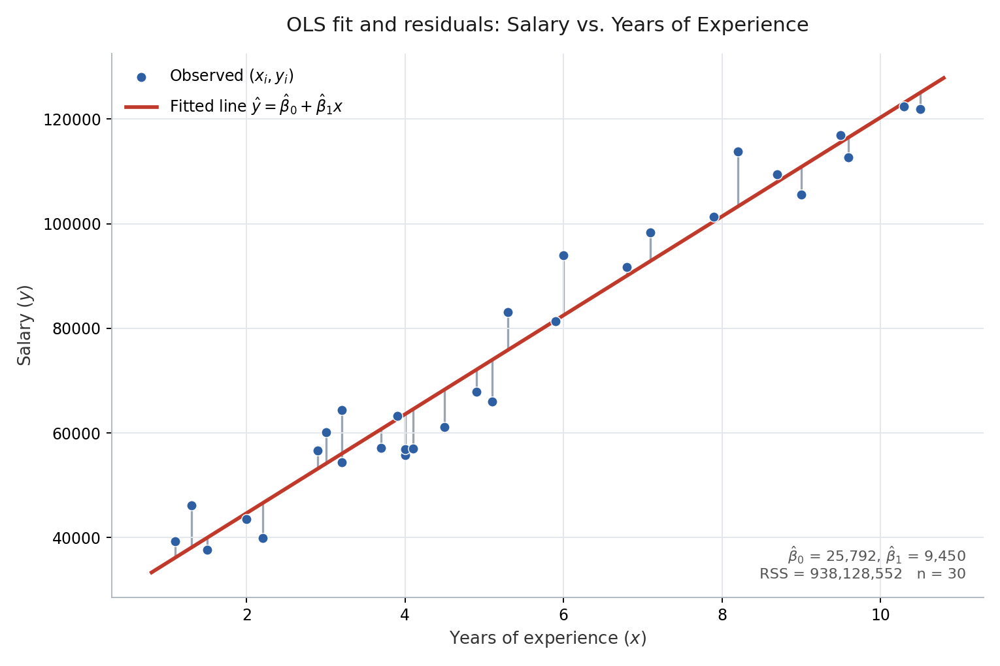

# Simple Linear Regression in Python

Simple linear regression models a numerical response using one predictor. Ordinary least squares (OLS) estimates the intercept and slope by minimizing the residual sum of squares (RSS).

## Linear regression in summation form

With $p$ predictors, the general linear regression function is

$$
f(\mathbf{x}_i) = \beta_0 + \sum_{j=1}^{p} \beta_j x_{ij}.
$$

Here, $j$ indexes predictors and $i$ indexes observations. Simple linear regression is the special case $p = 1$:

$$
f(x_i) = \beta_0 + \sum_{j=1}^{1} \beta_j x_{ij}
= \beta_0 + \beta_1 x_i.
$$

The model is linear in its coefficients.

After fitting, the prediction function is

$$
\hat f(x) = \hat\beta_0 + \hat\beta_1 x,
\qquad
\hat y_i = \hat f(x_i).
$$

A hat indicates an estimated coefficient or a predicted response.

## Residual sum of squares (RSS)

*Fit on this repo's `Salary_Data.csv`. Each grey vertical segment is one residual $e_i = y_i - \hat y_i$; RSS is the sum of their squared lengths.*

A residual is the difference between an observed response and its fitted value:

$$
e_i = y_i - \hat y_i.
$$

The fitted model's RSS is

$$
\mathrm{RSS} = \sum_{i=1}^{n} e_i^2
= \sum_{i=1}^{n}(y_i - \hat y_i)^2.
$$

To fit the model, treat RSS as a sum over candidate coefficient values rather than the fixed estimates:

$$
\mathrm{RSS} = \sum_{i=1}^{n}(y_i - \beta_0 - \beta_1 x_i)^2.
$$

OLS chooses the coefficients that minimize this sum:

$$
(\hat\beta_0, \hat\beta_1)
= \underset{\beta_0,\beta_1}{\operatorname{arg\,min}}
\sum_{i=1}^{n}(y_i - \beta_0 - \beta_1 x_i)^2.
$$

Squaring prevents positive and negative residuals from canceling and gives larger residuals more weight. RSS measures the total squared vertical distance from observations to the fitted line. A smaller training RSS indicates a closer fit to those observations, but does not guarantee better predictions on new data.

## Least-squares coefficient formulas

First calculate the sample means:

$$
\bar x = \frac{1}{n}\sum_{i=1}^{n}x_i,
\qquad
\bar y = \frac{1}{n}\sum_{i=1}^{n}y_i.
$$

The estimated slope and intercept are

$$
\hat\beta_1 =
\frac{\sum_{i=1}^{n}(x_i - \bar x)(y_i - \bar y)}
{\sum_{i=1}^{n}(x_i - \bar x)^2},
\qquad
\hat\beta_0 = \bar y - \hat\beta_1\bar x.
$$

These formulas are the solution obtained by setting the two partial derivatives of RSS to zero. They require variation in $x$: if all predictor values are identical, the denominator is zero and the slope and intercept cannot be uniquely estimated.

## Interpretation

OLS can be computed without assuming normally distributed errors. Statistical interpretation and inference require additional assumptions: a correctly specified linear conditional mean, errors with conditional mean zero, and appropriate assumptions about dependence and variance. Classical standard-error formulas assume uncorrelated errors with constant variance; exact small-sample t-based inference additionally assumes normal errors. A fitted association alone does not establish causation.
