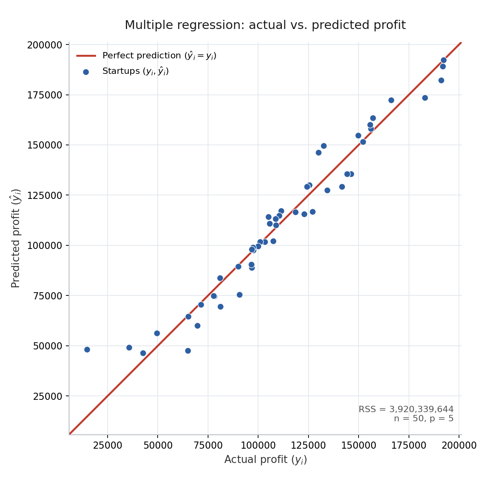

# Multiple Linear Regression in Python

Multiple linear regression models a numerical response using several predictors at once. Ordinary least squares (OLS) fits the model by minimizing the residual sum of squares (RSS). The [notebook](multiple_linear_regression.ipynb) uses the included [startup dataset](50_Startups.csv) to predict profit from spending and state; the mathematics below applies more generally to multiple numerical input columns, including encoded categories.

## Linear regression in summation form

The model represents the average response as

$$
\Large f(X) = E(Y \mid X) = \beta_0 + \sum_{j=1}^{p} X_j\beta_j.
$$

- $Y$: the response, also called the output, target, or dependent variable.
- $X$: the collection of predictors, also called inputs, features, or explanatory variables; $X_j$ is its $j$th predictor.
- $E(Y \mid X)$: the conditional mean, or average response among observations with the given predictor values. The model uses $f(X)$ to represent this mean.
- $\beta_0$: the intercept, the modeled mean response when all predictors are zero. Its units are the same as the response.
- $\beta_j$: the coefficient of predictor $j$, the change in the modeled mean response for a one-unit increase in that predictor while holding the others fixed. Its units are response units per predictor unit.
- $p$: the number of predictor columns, including any columns created by categorical encoding; $j$ indexes them from $1$ to $p$.
- $\sum$: the summation symbol, which adds the terms over the indicated index range.

The equality states the linear conditional-mean assumption. If the true relationship is not linear, this model can still serve as an approximation, but it may miss systematic patterns. With two predictors, the fitted surface is a plane; with more predictors, it is a higher-dimensional version of a plane. The intercept may have little practical meaning if the all-zero input combination is outside the data or impossible.

Each coefficient describes an association after accounting for the other predictors. It can therefore differ substantially from the slope of a regression using that predictor alone. For example, spending categories may increase together; fitting them jointly separates their conditional associations with profit to the extent the data allow. Holding predictors fixed is a mathematical comparison, and a fitted association alone does not establish causation.

## Residual sum of squares (RSS)

*Fit on this repo's `50_Startups.csv` (R&D spend, administration, marketing spend, and one-hot encoded state; $n=50$, $p=5$ predictor columns). Points closer to the diagonal have smaller residuals; RSS is the sum of their squared vertical distances from it.*

For each observation, the fitted model predicts

$$
\Large \hat y_i = \hat\beta_0 + \sum_{j=1}^{p} x_{ij}\hat\beta_j.
$$

Lowercase $x$ and $y$ denote observed predictor and response values. The index $i$ identifies an observation, so $x_{ij}$ selects its predictor $j$. A hat indicates a quantity estimated from data: the hatted coefficients are fitted parameters, and $\hat y$ is the predicted response. These indexing and hat conventions apply throughout the equations.

The difference between the observed response and its prediction is

$$
\Large e_i = y_i - \hat y_i.
$$

Here, $e$ is the residual. A positive residual means the model underpredicts the response; a negative residual means it overpredicts. A zero residual means the prediction matches that observation. Residuals measure differences in response units, not distances along the predictor axes.

Square these residuals and add them to measure the overall training discrepancy:

$$
\Large \mathrm{RSS} = \sum_{i=1}^{n} e_i^2
= \sum_{i=1}^{n}\left(y_i - \hat\beta_0 - \sum_{j=1}^{p}x_{ij}\hat\beta_j\right)^2.
$$

Here, $n$ is the number of training observations. The inner sum combines the contributions of all predictors for one observation; the outer sum adds the squared discrepancies across observations. Squaring prevents positive and negative residuals from canceling and gives large discrepancies more weight: doubling a residual makes its contribution four times as large.

OLS chooses all coefficients jointly to minimize RSS. Fitting a separate simple regression for each predictor generally does not give the same result, because the joint fit accounts for relationships among the predictors. Adding predictors cannot increase the minimum training RSS on the same observations, but it can worsen predictions on new data. The notebook therefore reserves a test set for evaluating predictions.

Computing the OLS fit does not require normally distributed errors. Interpreting the model as the conditional mean requires the underlying errors (deviations from that mean, rather than fitted residuals) to have conditional mean zero. Uncertainty estimates also need assumptions about dependence and variance: classical standard-error formulas assume uncorrelated errors with constant variance, and exact small-sample t-based inference additionally assumes normal errors.

## Least-squares coefficient formulas

Matrix notation collects all observations into one prediction equation:

$$
\Large \hat{\mathbf y} = \mathbf X\hat{\boldsymbol\beta}.
$$

- $\mathbf X$: the design matrix, with $n$ rows and $p+1$ columns. Each row contains one observation's predictors, preceded by a $1$ for the intercept. This bold symbol denotes the training-data matrix, rather than the generic predictor collection $X$ above.
- $\hat{\boldsymbol\beta}$: the column vector of fitted coefficients, ordered from the intercept through the coefficient of predictor $p$.
- $\mathbf y$ and $\hat{\mathbf y}$: the column vectors collecting the observed and predicted training responses, respectively.

Multiplying one row of the design matrix by the coefficient vector gives that observation's prediction. The leading $1$ ensures that the intercept is added to every prediction.

Setting the partial derivatives of RSS with respect to the coefficients to zero gives the **normal equations**:

$$
\Large \mathbf X^{\mathsf T}\mathbf X\hat{\boldsymbol\beta}
= \mathbf X^{\mathsf T}\mathbf y.
$$

The superscript $\mathsf T$ denotes a transpose, which exchanges a matrix's rows and columns. These equations make the fitted residual vector orthogonal to every design-matrix column: its dot product with each column is zero. Because the design matrix includes a column of ones, the training residuals also sum to zero, apart from numerical rounding.

When the design matrix has full column rank, the unique coefficient solution is

$$
\Large \hat{\boldsymbol\beta}
= (\mathbf X^{\mathsf T}\mathbf X)^{-1}\mathbf X^{\mathsf T}\mathbf y.
$$

The superscript $-1$ denotes a matrix inverse. Full column rank means no design-matrix column is an exact linear combination of the others. Under this condition, the inverse exists and the coefficients are uniquely determined. This is a compact mathematical expression; numerical least-squares methods can solve the problem without explicitly forming this inverse.

If columns are exactly dependent, the inverse does not exist and different coefficient vectors can produce the same fitted training predictions. Even without exact dependence, strongly related predictors can make individual coefficient estimates sensitive to small changes in the data. This is why good predictive performance does not automatically imply precise estimates of each predictor's separate association.

## Connection to this notebook

The notebook uses R&D spending, administration spending, marketing spending, and state to predict profit. It one-hot encodes state, splits the data into 80% training and 20% test observations, fits `LinearRegression`, and prints predicted profits beside the observed test values.

The current `OneHotEncoder()` keeps an indicator column for every state. Each row has one state indicator equal to 1 and the others equal to 0, so these columns sum to the intercept column of ones. The design matrix is therefore rank deficient, and the inverse formula above does not apply directly to this setup.

A numerical least-squares solver can still produce a fit, with unique fitted training predictions even though the coefficients are not uniquely identifiable. For valid state encodings, differences between state coefficients describe predicted differences between states at the same spending levels; an individual state coefficient should not be treated as an independently identifiable effect.

An alternative parameterization would omit one state's indicator and use that state as the reference category. This removes the specific dependency between the state indicators and the intercept, allowing the remaining state coefficients to represent differences from the reference state, provided no other exact dependencies remain. The notebook currently retains all state indicators.
