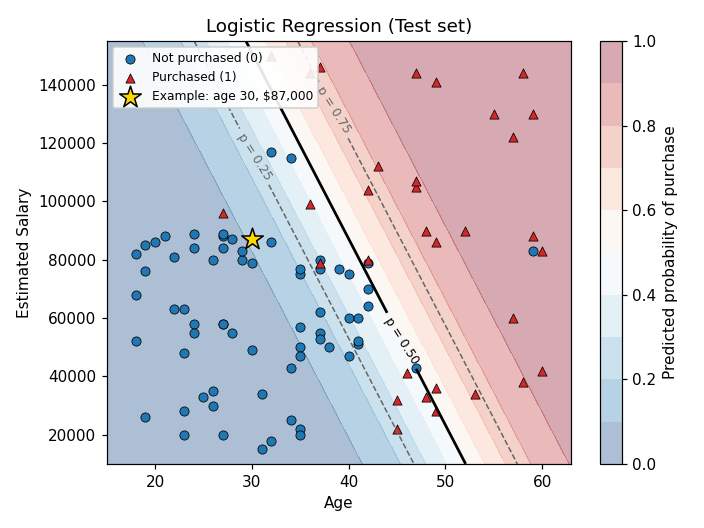

# Logistic Regression in Python

Logistic regression models the probability that an observation belongs to a class. Despite its name, it is a classification method: it predicts a qualitative response, usually by comparing that probability with a threshold. Unlike linear regression, it is not fit by minimizing the residual sum of squares (RSS); it is fit by maximum likelihood. The [notebook](logistic_regression.ipynb) applies this method to the included [social network ads dataset](Social_Network_Ads.csv), predicting whether a user purchased from age and estimated salary. The mathematics below follows ISLP, Section 4.3, for the model and ESL, Section 4.4, for the fitting procedure, and it applies to any binary response with numerical inputs.

## The logistic model

Write the response as $Y \in \{0, 1\}$ and the probability of the class coded as $1$ as

```math
\Large p(X) = \Pr(Y = 1 \mid X).
```

A straight line, $p(X) = \beta_0 + \beta_1 X$, can produce values below $0$ or above $1$, which cannot be probabilities. Logistic regression instead passes the linear combination of predictors through the *logistic function* (ISLP, Equation 4.7):

```math
\Large p(X) = \frac{e^{\beta_0 + \beta_1 X_1 + \cdots + \beta_p X_p}}{1 + e^{\beta_0 + \beta_1 X_1 + \cdots + \beta_p X_p}}.
```

- $Y$: the response, coded $1$ for the class of interest (here, a purchase) and $0$ otherwise.
- $X$: the collection of predictors; $X_j$ is its $j$th predictor and $p$ is the number of predictors.
- $\Pr(Y = 1 \mid X)$: the conditional probability that the response equals $1$ given the predictor values. The model writes it as $p(X)$.
- $\beta_0$: the intercept.
- $\beta_j$: the coefficient of predictor $j$.
- $e$: the base of the natural logarithm, about $2.718$.

Whatever the value of the linear combination in the exponent, the result lies strictly between $0$ and $1$. Large positive values push the probability toward $1$, large negative values push it toward $0$, and a value of zero gives exactly $0.5$. Plotted against one predictor, the probability follows an S-shaped curve rather than a straight line.

## Odds and log-odds

Rearranging the logistic function gives the *odds* (ISLP, Equation 4.3):

```math
\Large \frac{p(X)}{1 - p(X)} = e^{\beta_0 + \beta_1 X_1 + \cdots + \beta_p X_p}.
```

The odds range from $0$ to $\infty$. For example, a probability of $0.2$ gives odds of $0.2 / 0.8 = 1/4$: one purchase for every four non-purchases. Taking the logarithm of both sides gives the *log-odds*, or *logit* (ISLP, Equation 4.6):

```math
\Large \log\left(\frac{p(X)}{1 - p(X)}\right) = \beta_0 + \beta_1 X_1 + \cdots + \beta_p X_p.
```

Here, $\log$ is the natural logarithm. The model is therefore linear in the log-odds, not in the probability. This changes how the coefficients are read:

- Increasing $X_j$ by one unit, while holding the other predictors fixed, changes the log-odds by $\beta_j$. Equivalently, it multiplies the odds by $e^{\beta_j}$.
- A positive coefficient raises the probability as its predictor increases; a negative coefficient lowers it.
- The change in the *probability* itself is not constant. It depends on where the observation lies on the S-shaped curve: the same one-unit increase moves the probability most when it is near $0.5$ and very little when it is near $0$ or $1$.

As with linear regression, each coefficient describes an association after accounting for the other predictors, and a fitted association alone does not establish causation.

## From probabilities to classes

To classify, compare the predicted probability with a threshold. With the usual threshold of $0.5$,

```math
\Large \hat y =
\begin{cases}
1 & \text{if } \hat p(x) > 0.5, \\
0 & \text{otherwise}.
\end{cases}
```

A hat marks a quantity estimated from data, and lowercase $x$ denotes one observation's predictor values. Because $\hat p(x) = 0.5$ exactly when the fitted log-odds equal zero, the *decision boundary* is the set of points where

```math
\Large \hat\beta_0 + \hat\beta_1 x_1 + \cdots + \hat\beta_p x_p = 0.
```

This is a linear equation, so logistic regression separates the classes with a straight line when there are two predictors, a plane with three, and a hyperplane in general. A different threshold can be chosen when one kind of error is more costly than the other. For example, a lower threshold flags more observations as class $1$, catching more true purchases at the cost of more false alarms. Changing the threshold moves the boundary parallel to itself without changing its orientation.

## Maximum likelihood

The coefficients are unknown and must be estimated from training data. Maximum likelihood chooses the coefficients that make the observed training labels most probable. For binary responses, the *likelihood function* is (ISLP, Equation 4.5)

```math
\Large \ell(\beta_0, \beta) = \prod_{i:\, y_i = 1} p(x_i) \prod_{i':\, y_{i'} = 0} \bigl(1 - p(x_{i'})\bigr).
```

- $i$ and $i'$: observation indices; the first product runs over the training observations with $y = 1$, the second over those with $y = 0$.
- $\prod$: the product symbol, which multiplies the terms over the indicated observations.
- $\beta$: the vector of coefficients $(\beta_1, \ldots, \beta_p)$.

The fit is good when the predicted probability is close to $1$ for observations labeled $1$ and close to $0$ for observations labeled $0$. Taking the logarithm turns the product into a sum. Writing $\beta$ to include the intercept and assuming each input vector $x_i$ includes a leading $1$, the *log-likelihood* for $N$ training observations is (ESL, Equation 4.20)

```math
\Large \ell(\beta) = \sum_{i=1}^{N} \Bigl\{ y_i \log p(x_i; \beta) + (1 - y_i) \log\bigl(1 - p(x_i; \beta)\bigr) \Bigr\}
= \sum_{i=1}^{N} \Bigl\{ y_i \beta^T x_i - \log\bigl(1 + e^{\beta^T x_i}\bigr) \Bigr\}.
```

The superscript $T$ denotes a transpose, so $\beta^T x_i$ is the linear combination of one observation's inputs. The negative of this log-likelihood is the *log loss*, or *binary cross-entropy*, used throughout machine learning. An observation labeled $1$ that receives a predicted probability near $0$ contributes a very large loss, so confident mistakes are penalized heavily.

To maximize the log-likelihood, set its derivatives to zero. These *score equations* are (ESL, Equation 4.21)

```math
\Large \frac{\partial \ell(\beta)}{\partial \beta} = \sum_{i=1}^{N} x_i \bigl(y_i - p(x_i; \beta)\bigr) = 0.
```

Each observation contributes its input vector weighted by its residual on the probability scale. Because the first input is the constant $1$, the first equation states that the fitted probabilities add up to the observed number of class-$1$ labels.

Unlike the least-squares equations for linear regression, these equations are *nonlinear* in $\beta$, so there is no closed-form solution. ESL solves them with the Newton–Raphson algorithm. In matrix form, each step is (ESL, Equation 4.26)

```math
\Large \beta^{\text{new}} = (\mathbf X^T \mathbf W \mathbf X)^{-1} \mathbf X^T \mathbf W \mathbf z,
\qquad
\mathbf z = \mathbf X \beta^{\text{old}} + \mathbf W^{-1}(\mathbf y - \mathbf p).
```

- $\mathbf X$: the $N \times (p+1)$ design matrix, one row per observation, with a leading column of ones.
- $\mathbf y$ and $\mathbf p$: the vectors of observed labels and of fitted probabilities at the current coefficients.
- $\mathbf W$: a diagonal matrix of weights, with $i$th diagonal element $p(x_i; \beta^{\text{old}})\bigl(1 - p(x_i; \beta^{\text{old}})\bigr)$.
- $\mathbf z$: the *adjusted response*.

Each step is a weighted least-squares fit, and the weights change from one iteration to the next. The algorithm is therefore called *iteratively reweighted least squares* (IRLS). The log-likelihood is concave, so this procedure typically converges, and $\beta = 0$ is a reasonable starting value.

When the training classes can be separated perfectly by a straight line, the likelihood keeps increasing as the coefficients grow, and the unpenalized estimates do not exist. The penalty described next keeps the coefficients finite.

## Regularization in scikit-learn

`LogisticRegression` in scikit-learn does not maximize the plain log-likelihood by default. It adds an $L_2$ penalty on the coefficients and minimizes

```math
\Large \frac{1}{2}\|\beta\|^2 + C \sum_{i=1}^{N} \Bigl\{ -y_i \log p(x_i) - (1 - y_i) \log\bigl(1 - p(x_i)\bigr) \Bigr\}.
```

- $\|\beta\|^2$: the sum of the squared coefficients, excluding the intercept.
- $C$: a positive tuning parameter, the inverse of the regularization strength. The default is $C = 1$.

Smaller values of $C$ shrink the coefficients more strongly toward zero; very large values approach the unpenalized maximum-likelihood fit. ESL presents the $L_1$ (lasso) version of the same idea, which subtracts $\lambda \sum_{j=1}^{p} \vert\beta_j\vert$ from the log-likelihood (ESL, Equation 4.31) and can set some coefficients exactly to zero. In scikit-learn, this corresponds to `penalty='l1'` with a compatible solver. Because the penalty treats all coefficients alike, the predictors should be on comparable scales, which is one reason to standardize them before fitting. The default `lbfgs` solver is a quasi-Newton method: it approximates the Newton step above rather than forming the Hessian matrix explicitly.

## More than two classes

For a response with $K > 2$ classes, the *softmax* form of multinomial logistic regression gives each class its own set of coefficients (ISLP, Equation 4.13):

```math
\Large \Pr(Y = k \mid X = x) = \frac{e^{\beta_{k0} + \beta_{k1} x_1 + \cdots + \beta_{kp} x_p}}{\sum_{l=1}^{K} e^{\beta_{l0} + \beta_{l1} x_1 + \cdots + \beta_{lp} x_p}}.
```

The probabilities of the $K$ classes add up to $1$, and an observation is assigned to the class with the largest probability. With two classes, this reduces to the logistic model above. The log-odds between any pair of classes remain linear in the predictors.

## Connection to this notebook



*Fit on this repo's `Social_Network_Ads.csv` with the notebook's split, scaling, and model. Shading shows the predicted probability of purchase; the solid line is the 0.5 decision boundary.*

The notebook predicts `Purchased` from `Age` and `EstimatedSalary` for 400 users, about 36% of whom purchased. It splits the data into 300 training and 100 test observations with `random_state=0`, fits `StandardScaler` on the training features only, and fits `LogisticRegression(random_state=0)`, which uses the default $L_2$ penalty with $C = 1$.

Because the inputs are standardized, each fitted coefficient refers to a one-standard-deviation increase in its predictor. The fitted intercept is about $-0.95$. The age coefficient is about $2.08$, so roughly 10 more years of age multiply the odds of purchase by about $e^{2.08} \approx 8.0$ at a fixed salary. The salary coefficient is about $1.11$, so roughly 34,500 more in estimated salary multiply the odds by about $3.0$ at a fixed age. Both coefficients are positive, so the decision boundary slopes downward: older users need a lower salary to reach a predicted probability of $0.5$. These estimates are slightly shrunk by the penalty compared with an unpenalized fit.

The notebook predicts the class for a 30-year-old with an estimated salary of 87,000. The fitted log-odds for this user are about $-2.06$, which gives a predicted purchase probability of about $0.11$. This is below $0.5$, so the predicted class is $0$ (no purchase); the star in the plot lies on the low-probability side of the boundary.

The test-set prediction and confusion-matrix sections of the notebook are currently empty. Running the same setup classifies 89 of the 100 test observations correctly: 65 true negatives, 24 true positives, 3 false positives, and 8 false negatives. The notebook's own plots show the predicted class regions for the training and test sets; the plot above adds the probability contours, which make the linear boundary and the gradual transition between classes visible.
