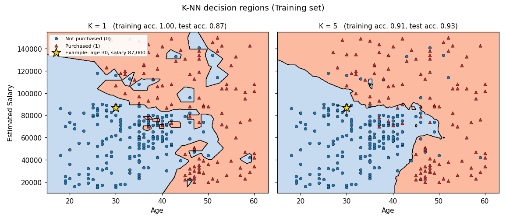

# K-Nearest Neighbors in Python

K-nearest neighbors (K-NN) classifies a new observation by looking at the training observations closest to it and taking a vote among their labels. Unlike logistic regression, it fits no coefficients and makes no assumption about the shape of the decision boundary: it is a *non-parametric*, *memory-based* method that keeps the training data and does its work at prediction time. The [notebook](k_nearest_neighbors.ipynb) applies this method to the included [social network ads dataset](Social_Network_Ads.csv), predicting whether a user purchased from age and estimated salary. The mathematics below follows ISLP, Section 2.2.3, and ESL, Sections 2.3.2 and 13.3, and it applies to any classification problem with numerical inputs.

## The Bayes classifier

ISLP introduces K-NN as an attempt to approximate an ideal rule. If the conditional class probabilities were known, the error rate on new data would be smallest, on average, when each observation is assigned to its most likely class (ISLP, Equation 2.10). That is, an observation with predictor vector $x_0$ is assigned to the class $j$ for which

```math
\Large \Pr(Y = j \mid X = x_0)
```

is largest.

- $Y$: the response, a class label. In this repo, $1$ means purchased and $0$ means not purchased.
- $X$: the collection of predictors; $x_0$ is the predictor vector of the observation being classified.
- $j$: a class label.
- $\Pr(Y = j \mid X = x_0)$: the conditional probability that the response is class $j$ given the predictor values $x_0$.

This rule is the *Bayes classifier*. With two classes, it predicts class $1$ when $\Pr(Y = 1 \mid X = x_0) > 0.5$. Its error rate, the *Bayes error rate*, is (ISLP, Equation 2.11)

```math
\Large 1 - E\left(\max_j \Pr(Y = j \mid X)\right),
```

where $E$ averages over all possible predictor values and $\max_j$ takes the largest class probability at each one. The Bayes error rate is above zero whenever the classes overlap: some observations with identical predictors belong to different classes, so no rule can classify all of them correctly. It plays the same role as the irreducible error in regression.

For real data, the conditional distribution of $Y$ given $X$ is unknown, so the Bayes classifier is an unattainable gold standard. K-NN estimates those probabilities directly from nearby training observations.

## The K-NN rule

Given a positive integer $K$ and an observation $x_0$, K-NN first identifies the $K$ training observations closest to $x_0$. It then estimates the probability of each class as the fraction of those neighbors that belong to it (ISLP, Equation 2.12):

```math
\Large \Pr(Y = j \mid X = x_0) = \frac{1}{K} \sum_{i \in \mathcal{N}_0} I(y_i = j).
```

- $K$: the number of neighbors, chosen by the user. It is not the number of classes.
- $\mathcal{N}_0$: the set of indices of the $K$ training observations closest to $x_0$.
- $i$: an observation index; $y_i$ is the observed label of training observation $i$.
- $I(y_i = j)$: an *indicator variable*, equal to $1$ when $y_i = j$ and $0$ otherwise.
- $\sum$: adds the indicator over the neighbors, so the sum counts the neighbors in class $j$.

K-NN then assigns $x_0$ to the class with the largest estimated probability, which is the same as a majority vote among the neighbors:

```math
\Large \hat y(x_0) = \arg\max_j \frac{1}{K} \sum_{i \in \mathcal{N}_0} I(y_i = j).
```

A hat marks a quantity estimated from data, and $\arg\max_j$ returns the class with the largest value rather than the value itself. For example, if $K = 5$ and the neighbors have labels $0, 1, 1, 0, 1$, the estimated probabilities are $3/5$ for class $1$ and $2/5$ for class $0$, so the prediction is class $1$. With two classes and an odd $K$, the vote cannot tie.

ESL writes the same rule for a $0/1$ response as an average of the neighbors' labels (ESL, Equation 2.8):

```math
\Large \hat Y(x) = \frac{1}{k} \sum_{x_i \in N_k(x)} y_i,
```

where $N_k(x)$ is the neighborhood of $x$ defined by the $k$ closest training inputs. This average is the fraction of neighbors labeled $1$, and predicting class $1$ when $\hat Y(x) > 0.5$ is the majority vote. The same averaging, applied to a numerical response, gives K-NN regression.

## Measuring closeness

"Closest" requires a distance. ESL uses Euclidean distance in feature space (ESL, Equation 13.1):

```math
\Large d_{(i)} = \|x_{(i)} - x_0\|.
```

Here, $x_{(i)}$ is a training input and $\|\cdot\|$ is the Euclidean length: the square root of the sum of squared coordinate differences. With $p$ predictors, it is a special case of the *Minkowski distance*,

```math
\Large d(x, x') = \left( \sum_{j=1}^{p} \vert x_j - x'_j \vert^{q} \right)^{1/q},
```

where $x_j$ and $x'_j$ are the $j$th coordinates of two observations and $q \geq 1$ is an exponent. Setting $q = 2$ gives Euclidean distance; setting $q = 1$ gives Manhattan distance, the sum of absolute differences. ISLP and ESL do not write out the Minkowski form; it is included here because the notebook's `KNeighborsClassifier` is configured with `metric='minkowski'`. scikit-learn calls the exponent `p`, which is a different quantity from the number of predictors $p$ used above.

Distances combine all predictors, so the units matter. ESL recommends first standardizing each feature to have mean zero and variance one:

```math
\Large z_j = \frac{x_j - \mu_j}{\sigma_j},
```

where $\mu_j$ and $\sigma_j$ are the mean and standard deviation of feature $j$, computed on the training data. Without this step, a predictor measured in large units, such as salary in dollars, dominates the distance, and a predictor measured in small units, such as age in years, barely affects which neighbors are chosen.

## Choosing K

$K$ controls the flexibility of the classifier:

- **Small $K$:** each prediction depends on a few nearby observations. The decision boundary is very irregular and follows local noise: low bias, high variance. With $K = 1$, every training observation is its own nearest neighbor, so the training error is always zero.
- **Large $K$:** each prediction averages over a broad neighborhood. The boundary becomes smoother and, for very large $K$, close to linear: lower variance, but higher bias. In the extreme, $K$ equal to the training size predicts the majority class everywhere.

ESL notes that although K-NN appears to have a single parameter, its *effective* number of parameters is about $N/k$, where $N$ is the training size: if the neighborhoods did not overlap, there would be $N/k$ of them, each contributing one fitted mean. Smaller $K$ therefore means a more complex model.

Because the training error always favors $K = 1$, it cannot be used to choose $K$. The *test error rate* on observations not used in training is the quantity of interest (ISLP, Equation 2.9):

```math
\Large \operatorname{Ave}\bigl(I(y_0 \neq \hat y_0)\bigr),
```

where $\operatorname{Ave}$ averages over the test observations, $y_0$ is a test label, and $\hat y_0$ is its predicted label. As $K$ decreases, the training error keeps falling while the test error typically follows a U-shape: it falls at first and then rises once the classifier overfits. In practice, $K$ is chosen by cross-validation (ISLP, Chapter 5).

## How good can K-NN be?

For large training sets, K-NN can come close to the Bayes classifier. A classical result of Cover and Hart, discussed in ESL, Section 13.3, shows that as the training data fill the feature space, the error rate of the 1-nearest-neighbor classifier is never more than twice the Bayes error rate. For two classes, writing $p_{k^*}(x)$ for the probability of the most likely class at $x$ and $p_k(x)$ for the probability of class $k$, ESL compares (ESL, Equations 13.2–13.4)

```math
\Large \text{Bayes error} = 1 - p_{k^*}(x),
\qquad
\text{1-nearest-neighbor error} = \sum_{k=1}^{K} p_k(x)\bigl(1 - p_k(x)\bigr) \geq 1 - p_{k^*}(x).
```

In this equation only, $K$ is the number of classes, following ESL's notation. The 1-nearest-neighbor error is at least the Bayes error, but asymptotically no more than twice it.

ISLP, Section 4.5, summarizes when K-NN works well in practice:

- It can outperform logistic regression when the true decision boundary is highly non-linear, provided the number of observations is large relative to the number of predictors.
- It needs many observations, because it reduces bias at the cost of variance.
- It does not tell us which predictors are important: there is no table of coefficients, as there is for logistic regression.

## Connection to this notebook



*Fit on this repo's `Social_Network_Ads.csv` with the notebook's split and scaling. Shading shows the predicted class: blue for no purchase, red for purchase. The right panel uses the notebook's model.*

The notebook predicts `Purchased` from `Age` and `EstimatedSalary` for 400 users. It splits the data into 300 training and 100 test observations with `random_state=0`, fits `StandardScaler` on the training features only, and fits `KNeighborsClassifier(n_neighbors=5, metric='minkowski', p=2)`: five neighbors, Euclidean distance, and an equal vote for each neighbor. Fitting only stores the scaled training data; the neighbor search happens when predicting.

The notebook predicts the class for a 30-year-old with an estimated salary of 87,000. Its five nearest training neighbors, after scaling, are users aged 28 to 31 with salaries from 80,000 to 89,000, and none of them purchased. The estimated purchase probability is therefore $0/5 = 0$, and the predicted class is $0$.

Scaling changes this neighborhood. Without it, distances are driven almost entirely by salary. The five nearest neighbors then all have salaries between 86,000 and 88,000, but their ages range from 18 to 41, and one of them purchased. Across the test set, the unscaled classifier is correct for 83 of 100 users, compared with 93 with scaling.

The notebook's confusion matrix on the 100 test users is

```math
\Large
\begin{bmatrix}
64 & 4 \\
3 & 29
\end{bmatrix},
```

with rows for the actual class and columns for the predicted class, in the order $0, 1$. It shows 64 true negatives, 4 false positives, 3 false negatives, and 29 true positives, for a test accuracy of $0.93$. On this split, the K-NN boundary bends to follow the data and makes 4 fewer test errors than the straight-line boundary of the [logistic regression notebook](../01%20Logistic%20Regression/).

The figure shows the effect of $K$. With $K = 1$, the boundary wraps around individual training points, creating small islands; training accuracy is $1.00$ but test accuracy drops to $0.87$. With the notebook's $K = 5$, the boundary is smoother, and training accuracy ($0.91$) and test accuracy ($0.93$) are close. Test accuracy is the same, $0.93$, for every odd $K$ from 3 to 15, and falls to $0.84$ at $K = 101$, where the neighborhoods become too broad. The notebook fixes $K = 5$ rather than choosing it by cross-validation, and a single 100-observation test set is too small to separate these values reliably.
