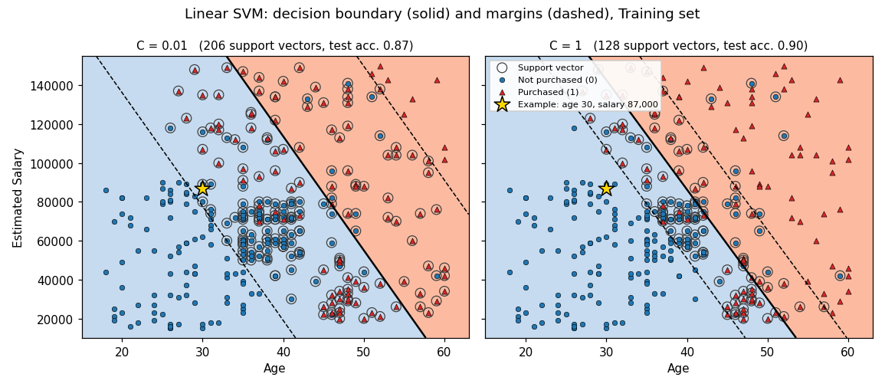

# Support Vector Machine in Python

A support vector machine (SVM) classifies observations by finding the boundary that separates the two classes with the widest possible margin. With a linear kernel, as in this folder, the method is called the *support vector classifier*: the decision boundary is a straight line in two dimensions, as in logistic regression, but it is chosen by a different criterion. Rather than modeling class probabilities, it tries to keep observations on the correct side of a margin, and only the observations near the boundary determine the fit. The [notebook](support_vector_machine.ipynb) applies this method to the included [social network ads dataset](Social_Network_Ads.csv), predicting whether a user purchased from age and estimated salary. The mathematics below follows ISLP, Sections 9.1, 9.2, and 9.5, and ESL, Sections 12.2 and 12.3.2, and it applies to any two-class problem with numerical inputs. Non-linear kernels are covered in the [Kernel SVM](../04%20Kernel%20SVM/) folder.

## Hyperplanes

SVMs code the two classes as $y_i \in \{-1, 1\}$ rather than $\{0, 1\}$; in this repo, $1$ means purchased and $-1$ means not purchased. A *hyperplane* in $p$ dimensions is the set of points satisfying

```math
\Large \beta_0 + \beta_1 X_1 + \beta_2 X_2 + \cdots + \beta_p X_p = 0.
```

- $X_j$: the $j$th predictor; $p$ is the number of predictors.
- $\beta_0$: the intercept, which shifts the hyperplane.
- $\beta_j$: the coefficient of predictor $j$; together, the coefficients set the hyperplane's orientation.

In two dimensions, a hyperplane is a line; in three, a plane. It divides the space into two halves. A *separating hyperplane* puts every training observation on the side matching its class, which can be written compactly as (ISLP, Equation 9.8)

```math
\Large y_i(\beta_0 + \beta_1 x_{i1} + \beta_2 x_{i2} + \cdots + \beta_p x_{ip}) > 0 \quad \text{for all } i = 1, \ldots, n.
```

Here, $x_{ij}$ is the value of predictor $j$ for training observation $i$, and $n$ is the number of training observations. Multiplying by $y_i$ makes the product positive exactly when the observation is on its own class's side: a positive value for class $1$, or a negative value for class $-1$.

A new observation $x^*$ is classified by the sign of

```math
\Large f(x^*) = \beta_0 + \beta_1 x_1^* + \beta_2 x_2^* + \cdots + \beta_p x_p^*.
```

A positive value gives class $1$ and a negative value gives class $-1$. The magnitude also carries information: a value far from zero means the observation lies far from the hyperplane, so the class assignment is more confident.

## The maximal margin classifier

If the classes can be separated perfectly, infinitely many separating hyperplanes exist, because a separating line can usually be shifted or rotated slightly without touching any observation. The *maximal margin classifier* chooses the one farthest from the training observations. The *margin* is the smallest perpendicular distance from the training observations to the hyperplane, and the classifier maximizes it (ISLP, Equations 9.9–9.11):

```math
\Large
\begin{aligned}
&\underset{\beta_0, \beta_1, \ldots, \beta_p, M}{\text{maximize}} \; M \\
&\text{subject to } \sum_{j=1}^{p} \beta_j^2 = 1, \\
&y_i(\beta_0 + \beta_1 x_{i1} + \cdots + \beta_p x_{ip}) \geq M \quad \text{for all } i = 1, \ldots, n.
\end{aligned}
```

- $M$: the margin, the distance from the hyperplane to the closest training observations.
- $\sum_{j=1}^{p} \beta_j^2 = 1$: a scaling constraint. Multiplying every coefficient by the same nonzero number describes the same hyperplane, so this fixes one representative. With it, the left side of the last constraint is the signed perpendicular distance from observation $i$ to the hyperplane.

The last constraint requires every observation to be on the correct side and at least a distance $M$ away. The result is the widest "slab" that fits between the two classes, with the hyperplane as its midline. The observations lying exactly on the edges of the slab are the *support vectors*: if they moved, the hyperplane would move too. Moving any other observation, without crossing the margin, would not change it.

ESL shows that dropping the scaling constraint and setting $M = 1/\|\beta\|$ gives an equivalent and more convenient problem (ESL, Equation 12.4):

```math
\Large \min_{\beta, \beta_0} \|\beta\| \quad \text{subject to } y_i(x_i^T \beta + \beta_0) \geq 1, \; i = 1, \ldots, N.
```

Here, $\beta$ is the vector $(\beta_1, \ldots, \beta_p)$, $\|\beta\|$ is its Euclidean length, $x_i^T \beta$ is the linear combination $\beta_1 x_{i1} + \cdots + \beta_p x_{ip}$, and $N$ is the number of training observations (ESL's notation for $n$). The margin is $1/\|\beta\|$ on each side, so the full slab is $2/\|\beta\|$ wide, and making the coefficients small makes the margin wide.

## The support vector classifier

Real classes usually overlap, so no separating hyperplane exists. Even when one does, it can be overly sensitive: adding a single observation near the boundary can swing the maximal margin hyperplane dramatically. The *support vector classifier*, or *soft margin classifier*, allows some observations to fall on the wrong side of the margin, or even of the hyperplane, in exchange for a more robust fit. ISLP writes it as (ISLP, Equations 9.12–9.15)

```math
\Large
\begin{aligned}
&\underset{\beta_0, \beta_1, \ldots, \beta_p, \epsilon_1, \ldots, \epsilon_n, M}{\text{maximize}} \; M \\
&\text{subject to } \sum_{j=1}^{p} \beta_j^2 = 1, \\
&y_i(\beta_0 + \beta_1 x_{i1} + \cdots + \beta_p x_{ip}) \geq M(1 - \epsilon_i), \\
&\epsilon_i \geq 0, \quad \sum_{i=1}^{n} \epsilon_i \leq C.
\end{aligned}
```

The $\epsilon_i$ are *slack variables*, one per observation, that measure how far each observation is allowed to violate the margin:

- $\epsilon_i = 0$: observation $i$ is on the correct side of the margin.
- $0 < \epsilon_i \leq 1$: it is inside the margin but still on the correct side of the hyperplane.
- $\epsilon_i > 1$: it is on the wrong side of the hyperplane, so it is misclassified.

In ISLP's formulation, $C$ is a nonnegative *budget* for the total amount of violation. With $C = 0$, no violations are allowed, and the problem reduces to the maximal margin classifier. With a larger budget, more violations are tolerated and the margin widens. Because each misclassified observation has $\epsilon_i > 1$, at most $C$ training observations can be misclassified.

The key property of this problem is that only observations lying on the margin or violating it affect the hyperplane. These are the support vectors. An observation strictly on the correct side of the margin can move anywhere on that side without changing the classifier. This makes the method robust to observations far from the boundary, which is similar to logistic regression and different from linear discriminant analysis.

## The cost parameter in ESL and scikit-learn

ESL writes the same classifier in a form that scikit-learn uses (ESL, Equation 12.8):

```math
\Large \min_{\beta, \beta_0} \frac{1}{2}\|\beta\|^2 + C \sum_{i=1}^{N} \xi_i
\quad \text{subject to } \xi_i \geq 0, \; y_i(x_i^T \beta + \beta_0) \geq 1 - \xi_i \;\; \text{for all } i.
```

The $\xi_i$ play the role of ISLP's slack variables. Here, however, $C$ is a *cost* for violations rather than a budget, so it works in the opposite direction:

| | Small $C$ | Large $C$ |
|---|---|---|
| ISLP (budget, Eq. 9.15) | few violations allowed, narrow margin | many violations allowed, wide margin |
| ESL and scikit-learn (cost, Eq. 12.8) | violations are cheap, wide margin | violations are expensive, narrow margin |

The separable case corresponds to a budget of $C = 0$ in ISLP and a cost of $C = \infty$ in ESL. The rest of this README uses $C$ in the ESL and scikit-learn sense.

$C$ controls the bias-variance trade-off. A wide margin involves many support vectors, so the classifier has low variance but potentially high bias. A narrow margin depends on few support vectors, giving low bias but potentially high variance. In practice, $C$ is chosen by cross-validation.

## The solution depends only on the support vectors

ESL solves this optimization problem with Lagrange multipliers. The fitted coefficients take the form (ESL, Equation 12.17)

```math
\Large \hat\beta = \sum_{i=1}^{N} \hat\alpha_i y_i x_i,
```

where the $\hat\alpha_i$ are nonnegative weights from the optimization, each between $0$ and $C$. A hat marks a fitted quantity. The weight is nonzero only for the support vectors, so the coefficient vector is built from them alone:

- Support vectors exactly on the edge of the margin have $0 < \hat\alpha_i < C$.
- Support vectors that violate the margin have $\hat\alpha_i = C$.

The decision function is then (ESL, Equation 12.18)

```math
\Large \hat G(x) = \operatorname{sign}\bigl[x^T \hat\beta + \hat\beta_0\bigr].
```

Substituting the form of $\hat\beta$ shows that predictions depend on the training data only through inner products $x^T x_i$ with the support vectors. Replacing those inner products with a *kernel* is what turns the support vector classifier into a non-linear SVM.

## Hinge loss and the connection to logistic regression

The same classifier can be written as an unconstrained "loss + penalty" problem (ESL, Equation 12.25; ISLP, Equation 9.25):

```math
\Large \min_{\beta_0, \beta} \sum_{i=1}^{N} \bigl[1 - y_i f(x_i)\bigr]_+ + \frac{\lambda}{2}\|\beta\|^2,
\qquad f(x) = x^T \beta + \beta_0.
```

The subscript $+$ means the positive part: $[u]_+ = \max(0, u)$. This loss is the *hinge loss*. It is zero for observations with $y_i f(x_i) \geq 1$, which are on the correct side of the margin, and increases linearly for observations that violate it. The second term is the ridge penalty, and the solution matches the cost formulation with $\lambda = 1/C$.

Logistic regression minimizes a similar loss, the negative log-likelihood, which in this $\pm 1$ coding is $\log\bigl(1 + e^{-y_i f(x_i)}\bigr)$. The two losses have similar shapes: both grow roughly linearly for badly misclassified points and are small for points far on the correct side. The difference is that the hinge loss is *exactly* zero beyond the margin, which is why only support vectors affect the SVM, while the logistic loss is small but never zero. As a result, the two methods often give very similar boundaries. ISLP notes that SVMs tend to behave better when the classes are well separated, while logistic regression is often preferred when they overlap substantially. ESL adds that the hinge loss estimates the class directly, whereas logistic regression estimates class probabilities: a plain SVM does not produce probabilities.

## Connection to this notebook



*Fit on this repo's `Social_Network_Ads.csv` with the notebook's split and scaling. The solid line is the decision boundary, where the decision function is 0; the dashed lines are the margins, where it is −1 and 1. Circled points are support vectors. The right panel uses the notebook's model.*

The notebook predicts `Purchased` from `Age` and `EstimatedSalary` for 400 users. It splits the data into 300 training and 100 test observations with `random_state=0`, fits `StandardScaler` on the training features only, and fits `SVC(kernel='linear', random_state=0)`. This uses scikit-learn's default cost, $C = 1$. Scaling matters because the margin is measured as a distance in feature space: without it, salary in dollars would dominate. scikit-learn codes the labels internally as $\pm 1$, so the notebook's $0/1$ labels need no change.

In standardized units, the fitted decision function is about $f(x) = -0.77 + 1.60\,z_{\text{age}} + 0.97\,z_{\text{salary}}$, where $z$ denotes a standardized feature. The coefficient vector has length $\|\hat\beta\| \approx 1.87$, so the margin extends about $1/1.87 \approx 0.53$ standard deviations on each side of the boundary. Like the logistic regression coefficients, both are positive, so the boundary slopes downward: older users need a lower salary to be classified as buyers. Unlike logistic regression coefficients, these do not describe changes in log-odds; they only set the boundary's position and the margin's width.

The classes overlap considerably, so the margin is soft: 128 of the 300 training observations are support vectors, 64 from each class. Only 3 lie exactly on the margin; the other 125 violate it and have $\hat\alpha_i = C$, and 53 of those are on the wrong side of the boundary, giving a training accuracy of $0.82$.

The notebook predicts the class for a 30-year-old with an estimated salary of 87,000. The decision function for this user is about $-1.57$, which is negative and beyond the margin at $-1$, so the predicted class is no purchase.

The notebook's confusion matrix on the 100 test users is

```math
\Large
\begin{bmatrix}
66 & 2 \\
8 & 24
\end{bmatrix},
```

with rows for the actual class and columns for the predicted class, in the order $0, 1$. It shows 66 true negatives, 2 false positives, 8 false negatives, and 24 true positives, for a test accuracy of $0.90$. This is one more correct prediction than the [logistic regression notebook](../01%20Logistic%20Regression/) on the same split, which is consistent with the two methods having similar losses and both producing a straight-line boundary. The [K-NN notebook](../02%20K-Nearest%20Neighbors/), whose boundary can bend, reaches $0.93$.

The figure shows the effect of the cost parameter. With $C = 0.01$, violations are cheap: the margin is much wider, 206 training observations are support vectors, and test accuracy drops to $0.87$. Increasing $C$ to $10$ or $100$ barely changes the fit (125 to 126 support vectors, test accuracy $0.89$), because with this much class overlap the straight boundary cannot separate the classes no matter how expensive violations become. The notebook fixes $C = 1$ rather than choosing it by cross-validation.
